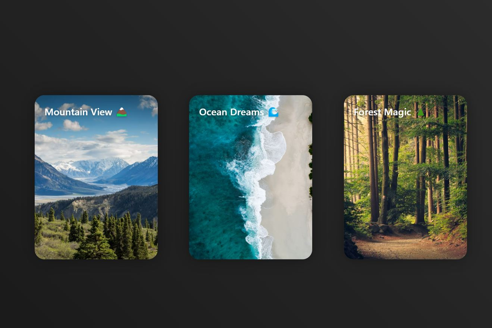

# 3D Card Hover Effect Project

Welcome to the **3D Card Hover Effect** project! This project demonstrates how to create an engaging 3D card effect that responds dynamically to the movement of the mouse. This effect is implemented using **HTML, CSS**, and **JavaScript**. The design was initially prototyped in **Figma** and transformed into code for a live implementation.



## Project Overview

This project creates an interactive 3D card effect, which is perfect for showcasing products or services with a modern and immersive feel. The card responds to mouse movements, creating a realistic depth effect.

### Features:

- **Mouse-Responsive 3D Effect**: The card reacts to the position of the cursor, tilting in a realistic manner.
- **Glass Effect and Smooth Hover Animations**: The card's content features a subtle glass effect using CSS properties like `backdrop-filter`, making the design look more modern.
- **JavaScript Mouse Tracking**: JavaScript is used to detect mouse movement and apply transformations, providing a dynamic 3D experience.

## How to Use

Simply clone the repository and open the `index.html` file in your browser to see the 3D card effect in action.

```sh
# Clone this repository
git clone <repository_url>

# Open the project
double-click index.html or open it with your preferred web server.
```

## Step-by-Step JavaScript Explanation

This project features a custom JavaScript script that enables the interactive 3D effect on the cards. Here's how it works:

1. **DOMContentLoaded Event**: The script waits until the DOM is fully loaded before executing, ensuring that all elements are accessible.
2. **Selecting All Cards**: The JavaScript selects all cards with the `.card` class to apply the 3D effect to each one.
3. **Mouse Movement Tracking**: As the mouse moves over a card, JavaScript calculates the position of the mouse relative to the center of the card. It then calculates the `rotateX` and `rotateY` values to achieve the tilt effect.
4. **Mouse Leave Event**: When the mouse leaves the card, it smoothly returns to its original position without any rotation.

The script creates a seamless interactive experience for the user, making the card feel like a real, physical object that tilts as you move the cursor.

## Design Inspiration

The design of the 3D cards was prototyped using **Figma**, which allowed for the creation of a detailed visual representation before moving into code. Check out the Figma profile for more design projects:

[Figma Profile - Alexander's Studio](https://figma.com/@alexandersstudi)

## Watch the Full Tutorial on YouTube

For a detailed guide on how to build this project, including the explanation of the JavaScript step by step, check out the full tutorial on my YouTube channel:

[Watch the 3D Card Tutorial on YouTube](https://www.youtube.com/@uxuiconexioncreativa/videos)

Make sure to **like, share, and subscribe** for more content on web design and creative UI/UX tutorials!

## Technologies Used

- **HTML**: To structure the card components.
- **CSS**: To style the cards, including the 3D perspective and glass effect.
- **JavaScript**: To dynamically calculate and apply 3D transformations based on mouse movement.

## Preview


## License

This project is licensed under the MIT License - see the [LICENSE](LICENSE) file for details.

## Connect with Me

- [YouTube Channel](https://www.youtube.com/@uxuiconexioncreativa/videos) - Tutorials on web design and development.
- [Figma Profile](https://figma.com/@alexandersstudi) - Follow for upcoming project designs.

## Contact

Feel free to reach out if you have any questions or suggestions on how to improve this project.

Happy coding!
